# How to Stake on Mainnet Ethereum

<!-- TODO: verify if this is recommended -->
> It is recommended to bridge your FUEL tokens to the Fuel Ignition network for staking, as it offers a much faster and more cost-effective experience compared to staking on the Ethereum mainnet.

<!-- TODO: add link -->
Please visit [app.fuel.network/staking/on-ethereum](https://docs.fuel.network/) to stake your tokens on the Fuel shared sequencer network from Ethereum. Below is a help guide, but if you prefer a video tutorial, please click [here](https://docs.fuel.network/) instead.

## Connect EVM Wallet

Start by connecting an Ethereum wallet with FUEL tokens, whether they are already in the shared sequencer network or in your mainnet wallet.

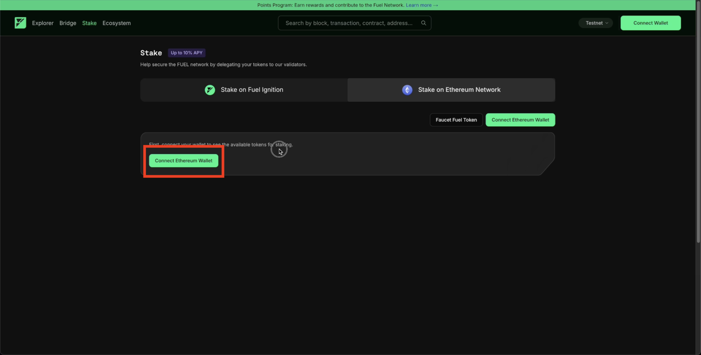

## Stake

From left to right, you can see your balance of FUEL tokens in your Ethereum wallet, your balance of FUEL tokens in the shared sequencer network, and the rewards accumulated. 

Please note that tokens still in your mainnet Ethereum wallet must be migrated to the shared sequencer network first before you can delegate and stake. Don’t worry, as this will follow the same flow.

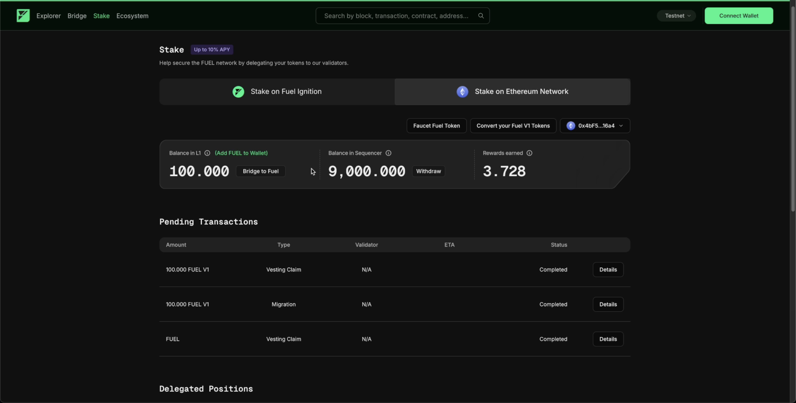

### Select Validator

Scroll down to the bottom of the page. There, you will see a list of validators. From the list, choose the validator to which you want to stake and delegate your FUEL tokens. Click the "Deposit" button.

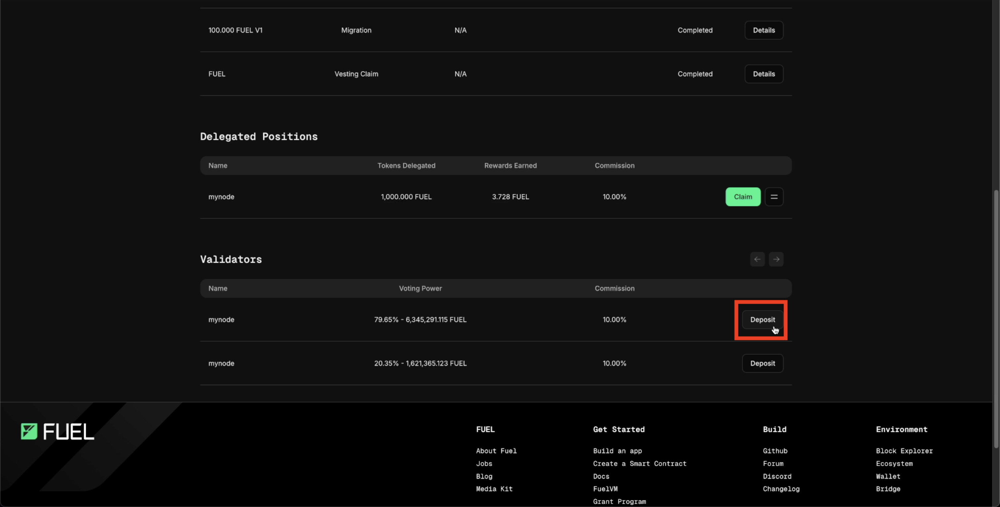

### Delegating Tokens

Select the amount of FUEL tokens you want to delegate, and approve those tokens.

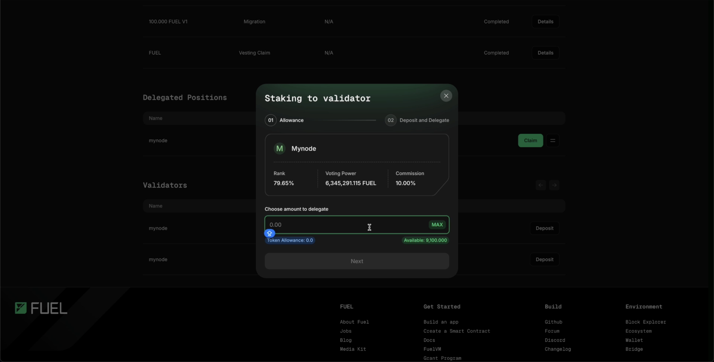

Once approved, confirm your delegation.

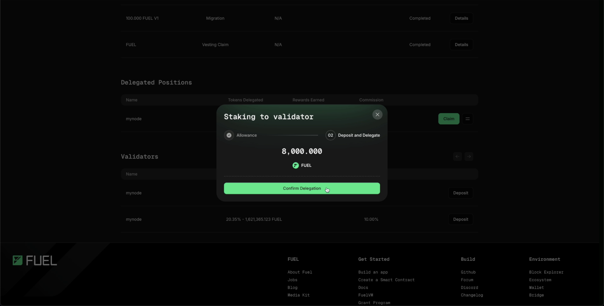

After the tokens have been successfully delegated and staked, you will see your tokens under "Delegated Positions."

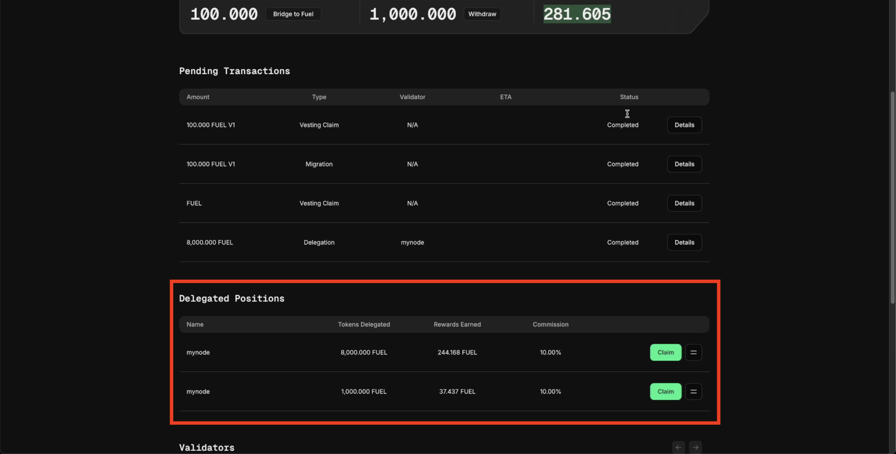

## Claim Rewards

After staking your FUEL tokens, you will immediately start to accumulate FUEL rewards, which you can claim. Click "Claim" on any of your open delegated positions to collect your rewards.

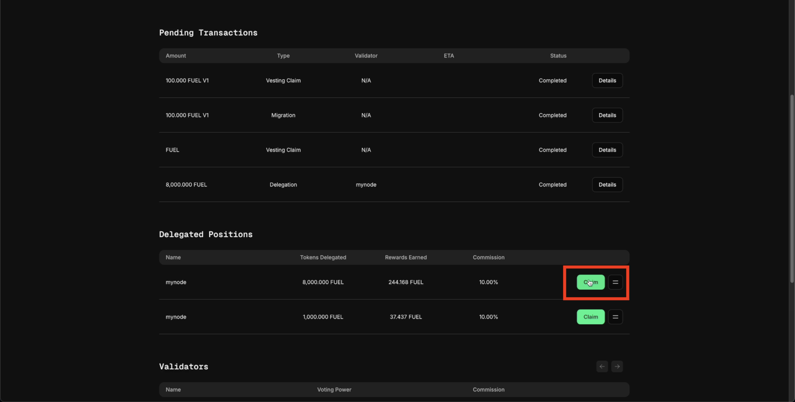

Your rewards will be added to your balance in the shared sequencer network.

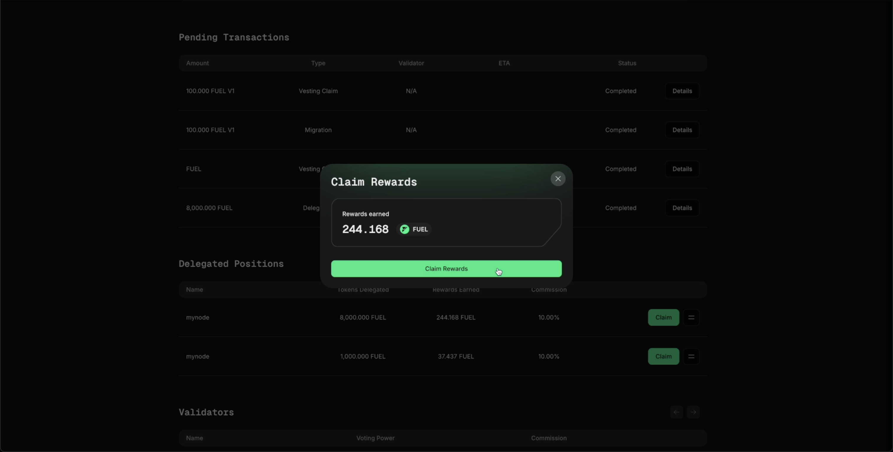

## Withdrawal

At any time, you can undelegate and withdraw your staked FUEL tokens.

### Undelegate

To undelegate your open positions, simply press the hamburger button beside your position and click the "Undelegate" button.

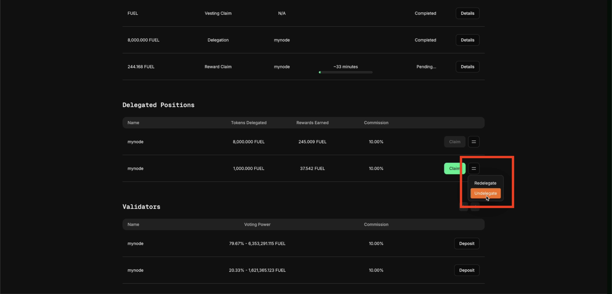

Here, you can select how many delegated tokens you wish to undelegate. These tokens will return to your balance in the shared sequencer network.

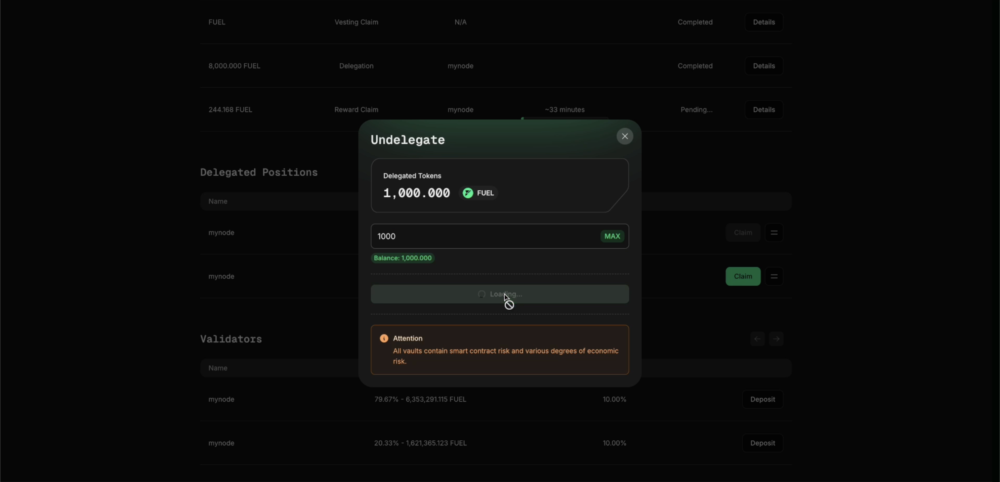

### Withdraw Balance in Sequencer

<!-- TODO: verify this is true -->

Lastly, you can withdraw your tokens from the shared sequencer network back to your mainnet Ethereum wallet by clicking the "Withdraw" button beside your balance in the shared sequencer.

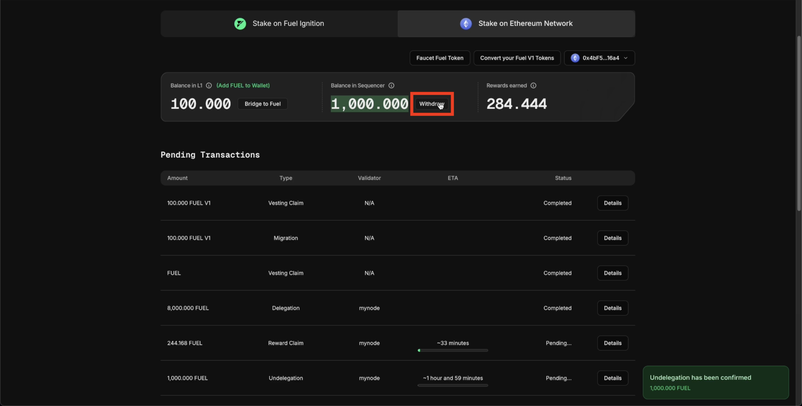

Here you can specify how many tokens you want to withdrawal.

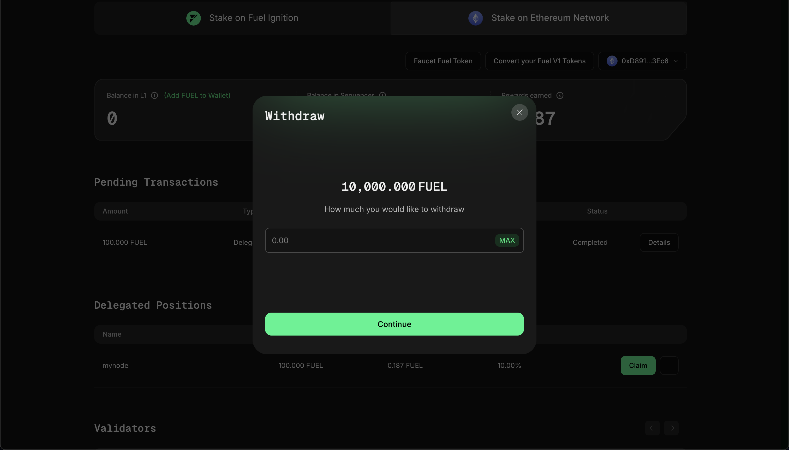
