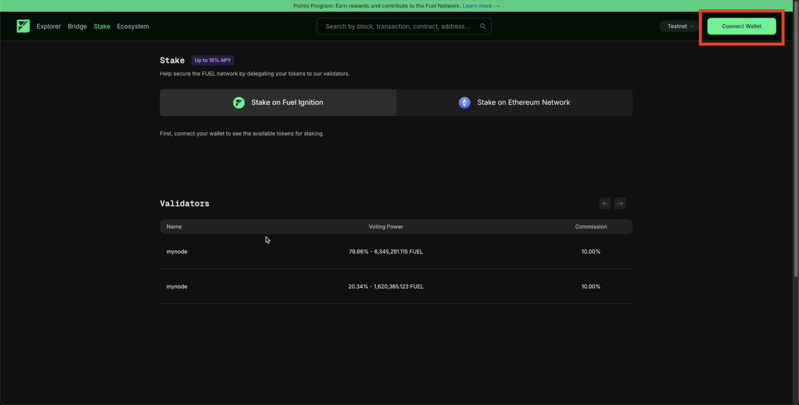
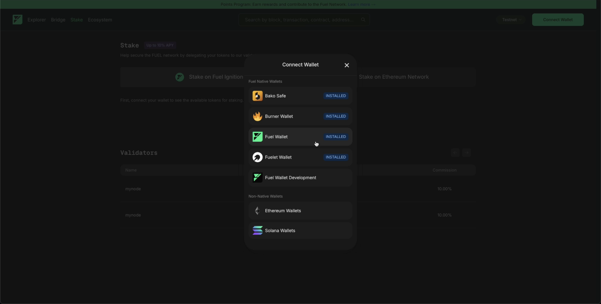
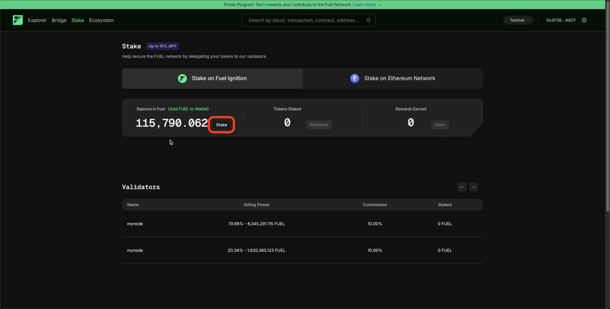
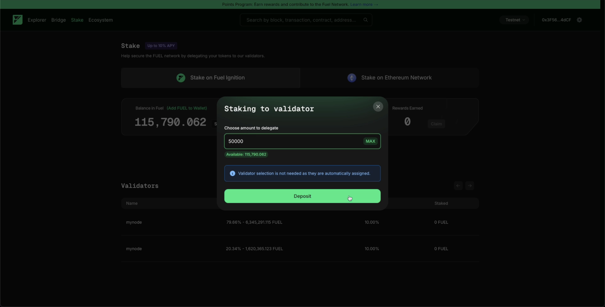
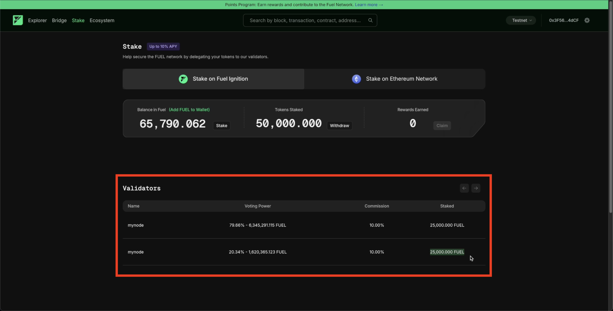
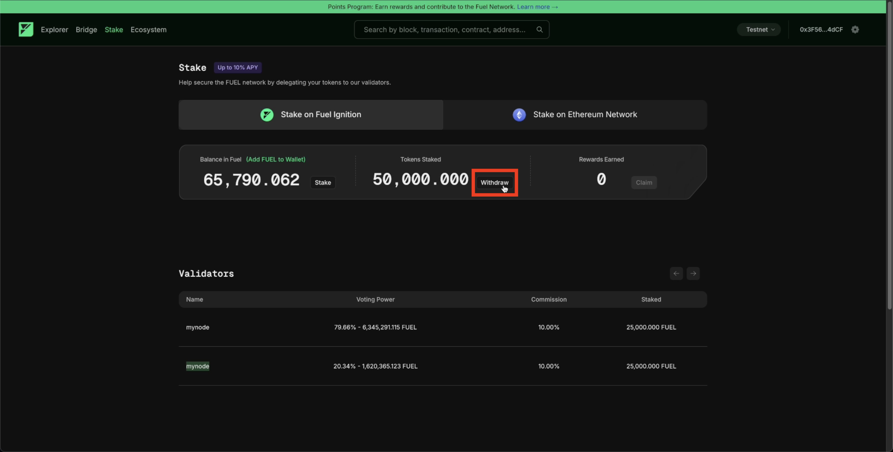
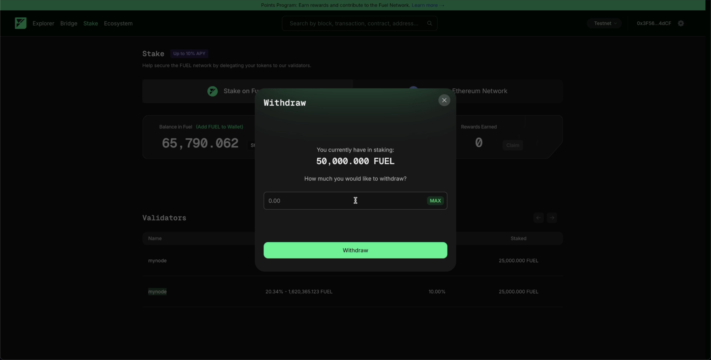
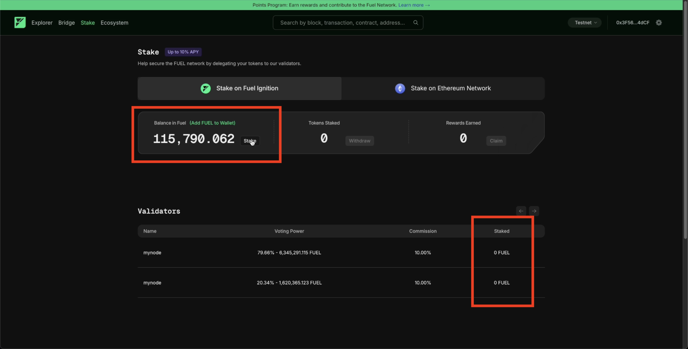
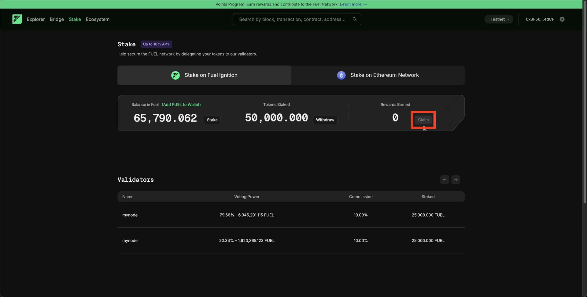

# How to Stake on Fuel

<u>***Step 1: Connect Your Fuel Wallet***</u>

To stake FUEL tokens on the Fuel sequencer network through Fuel Ignition, start by visiting app.fuel.network/staking/on-fuel. Connect your Fuel wallet, ensuring it holds FUEL tokens. The platform supports non-native EVM and SVM wallets, providing flexibility in wallet types.

<u>***Step 2: Stake Your Tokens***</u>

Once your wallet is connected, view your FUEL token balance, your staked amount on the sequencer network, and any rewards accrued. Click the "Stake" button beside your balance to begin. Enter the number of tokens you want to delegate, then confirm by pressing "Deposit." Unlike Ethereum mainnet staking, validator delegation on Fuel is automated, so you don’t need to manage validators individually. Your staked balance will update, and the dashboard will show the distribution of your tokens across validators.

<u>***Step 3: Manage Withdrawals and Claim Rewards***</u>

Staking on Fuel allows you to claim rewards as they accumulate. Click "Claim" next to your rewards balance to collect them. To withdraw your staked tokens, select "Withdraw" beside your staked amount, choose how many tokens to withdraw, and confirm. The undelegated tokens will return to your Fuel wallet, and the validator dashboard will reflect the updated balance.

Please visit [app.fuel.network/staking/on-fuel](https://app.fuel.network/staking/on-fuel) to stake your tokens on the Fuel Shared Sequencer Network through Fuel Ignition. Below, you'll find a helpful guide to get started.

## Connect Fuel Wallet

Start by connecting a Fuel wallet with FUEL tokens. This includes both non-native EVM and SVM wallets.

  

## Stake

From left to right, you can view your FUEL token balance in your Fuel wallet, your staked FUEL token balance on the shared sequencer network, and your accumulated rewards.

Press the "Stake" button next to your balance to begin the staking process.

Enter the number of tokens you wish to delegate to the validators. Then, click the "Deposit" button to stake your tokens.

Please note: unlike staking on mainnet Ethereum, the validator delegation process is automatically assigned, so you don’t need to manage each validator manually.

After successfully depositing, your total staked token balance will update. The dashboard below will display the distribution of your delegated tokens. In the example diagram, the tokens are distributed evenly among the validators.

## Withdraw

Withdrawing from the shared sequencer network is as simple as staking. Click the "Withdraw" button beside the amount of tokens you have staked.

Select the amount of FUEL tokens you wish to withdraw, then click the "Withdraw" button.

Your undelegated token balance will return to your Fuel wallet, and the validator dashboard will update accordingly as well.

## Claim Rewards

Once you have staked your FUEL tokens, you will start to accumulate FUEL rewards. Click "Claim" next to your earned rewards balance to collect your tokens.

